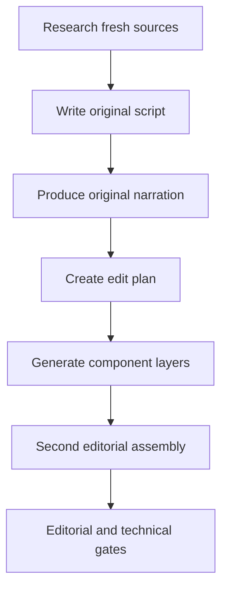

# Daily Video Production Runbook

Last verified: 2026-09-12 (Asia/Dhaka)

## Purpose

This file is the reusable context for producing one video per Mental Empire channel. A new session should read this file first, run the preflight checks, select fresh source videos for that day, and then execute the four channel workflows.

Do not save API-key values, session cookies, or authorization headers in this repository. Read credentials from Windows environment variables at runtime.

## Related project files

- `.agents/skills/mental-empire-daily-production/SKILL.md` — reusable Codex workflow and resumability rules.
- `PROGRESS.md` — concise current milestone and next action for an interrupted run.
- `docs/DAILY-VIDEO-PRODUCTION-IMPLEMENTATION-REPORT.md` — detailed 2026-08-31 implementation history, failures, fixes, rationale, artifacts, and verification.
- `scripts/production/transcribe-and-caption.mjs` — shared transcription and caption stage.
- `scripts/production/render-ramani.mjs` — Psyche Noir and Discipline Doctrine renderer.
- `scripts/production/plan-mindcipher.mjs` and `scripts/production/render-mindcipher.mjs` — MindCipher planning and rendering.
- `scripts/production/run-talkingphotos.mjs` — resumable Neural Vault web generation and local caption rendering.
- `docs/VIDEOEXPRESS-INTEGRATION.md`, `scripts/production/videoexpress-config.mjs`, and `scripts/production/run-videoexpress.mjs` — verified prompt-driven image-to-video clips in two workflows (`generated-still` and `direct-upload`), resumable state, and downloads.

Read `PROGRESS.md` first when resuming. Read the implementation report only when troubleshooting or changing the workflow.


## Required result

Produce four authored 16:9 videos per daily run. Component renderers do not equal finished edits.

| Channel | Required final treatment | Automatically insufficient |
| --- | --- | --- |
| Psyche Noir | Fictional/composite noir scenarios, symbolic motion, relationship/boundary graphics, evidence cards, and designed stills | Ramani image loop or static AI images plus captions |
| Discipline Doctrine | Action/process footage, Video Express scenes where needed, step/progress graphics, contrasts, and demonstrations | Generic motivational B-roll plus captions |
| Neural Vault | TalkingPhotos host as A-roll, then evidence, diagrams, examples, and motion cutaways in a second pass | Full talking avatar plus captions |
| MindCipher | Transcript-matched footage plus original explanatory graphics, evidence framing, and selected generated motion | Stock B-roll plus captions |

Every final uses an original channel-specific script/narration, a complete `editing/edit-plan.json`, more than one purposeful media family, and a second editorial assembly pass. These are internal quality controls, not claimed YouTube numeric requirements.


## Workflow map



Source videos provide research, claims to verify, counterpoints, and reference timestamps. They do not provide the final full narration. TalkingPhotos, B-roll renders, still composites, captions, and Video Express clips are component layers; the authored assembly is the final.

## Verified requirements

The following checks passed on 2026-08-31. Treat them as a snapshot and repeat the lightweight checks before each production run.

| Requirement | Runtime name or location | Verified state |
| --- | --- | --- |
| Meta planning model | `META_API_KEY`; model `muse-spark-1.2-contributor` | Streaming request with `reasoning.effort: xhigh` returned HTTP 200 and a completed event |
| Groq transcription | `GROQ_API_KEY`; model `whisper-large-v3-turbo` | Authentication and a transcription request succeeded |
| Pexels videos | `PEXELS_API_KEY` | Video search succeeded |
| Pixabay videos | `PIXABAY_API_KEY` | Video search succeeded |
| Coverr videos | `COVERR_API_KEY` | Video search succeeded |
| TalkingPhotos AI | `https://app.talkingphotos.ai` and captured session in `D:\talkingphotos-session` | Authentication succeeded; quota showed 0/100 and concurrency 0/5 |
| Video Express | `VIDEOEXPRESS_EMAIL`, `VIDEOEXPRESS_PASSWORD`, and `https://app.videoexpress.ai` | Direct login succeeded; library `4`, AI media folders, and queue returned HTTP 200; queue was 0/5 |
| NVIDIA GPU | GeForce GTX 1660 Ti, 6 GB | FFmpeg `h264_nvenc` one-second encode succeeded |
| Subtitle support | FFmpeg ASS/subtitles filters plus local caption fonts | Available |
| Psyche Noir images | `D:\YT Channel Files\ramani_assets\ramani_one` | 10 readable 1376x768 images |
| Discipline images | `D:\YT Channel Files\ramani_assets\ramani_two` | 9 readable 1376x768 images |
| Local B-roll | `D:\Mental Empire Studio\broll-library` | 894 videos, about 11.24 GB |
| Disk space | Drive `D:` | About 198 GB free at verification time |

The app already has a Meta backend for Auto B-roll, but its current shared constant is `muse-spark-1.2`. This workflow must call the Meta API directly with the exact model name `muse-spark-1.2-contributor`. Do not silently fall back to `muse-spark-1.2`; if the Contributor model is unavailable, report that branch as blocked.

### Required Meta request contract

Use the Responses endpoint, streaming, and extra-high reasoning. The credential is currently stored as `META_API_KEY` on this Windows machine; it serves the same purpose as `MODEL_API_KEY` in Meta's examples.

```powershell
$body = @'
{
  "model": "muse-spark-1.2-contributor",
  "input": [
    {
      "role": "user",
      "content": [
        { "type": "input_text", "text": "<B-roll planning prompt goes here>" }
      ]
    }
  ],
  "stream": true,
  "temperature": 1,
  "max_output_tokens": 32000,
  "top_p": 1,
  "reasoning": { "effort": "xhigh" }
}
'@

curl.exe -N -X POST "https://api.meta.ai/v1/responses" `
  -H "Authorization: Bearer $env:META_API_KEY" `
  -H "Content-Type: application/json" `
  -H "Accept: text/event-stream" `
  --data-binary $body
```

Before sending, assert that `model` equals `muse-spark-1.2-contributor` exactly and that `reasoning.effort` equals `xhigh`. Parse the server-sent event stream until `response.completed`; treat `response.failed` or a missing terminal event as a failed planning request.


## Preflight for every run

1. Read `AGENTS.md`, the daily-production skill, and both Analytics Hub strategy files at:
   - `D:\Work\youtube-analytics-hub\data\fetch-2026-09-04\VIDEO_MAKER_MASTER_PLANNER.md`
   - `D:\Work\youtube-analytics-hub\data\fetch-2026-09-04\VIDEO_EDITING_HANDBOOK.md`
2. Confirm required environment-variable names exist. Report only present/missing; never print values.
3. Verify Meta `muse-spark-1.2-contributor`, Groq `whisper-large-v3-turbo`, and relevant provider searches.
4. Confirm that each source is research/reference only and that the original script/narration path is recorded.
5. Create `editing/edit-plan.json` for each channel before asset generation. It must cover the full timeline and state media family, asset, treatment, provenance, and narrative purpose for every block.
6. Inspect `D:\talkingphotos-session`, quota, concurrency, and current contract before Neural Vault generation.
7. Read `docs/VIDEOEXPRESS-INTEGRATION.md` and run `node scripts/production/run-videoexpress.mjs --preflight` before every plan that assigns generated motion. Pilot one or two clips before scaling.
8. Confirm the B-roll library and current provenance manifest are readable. Old Ramani image folders are optional legacy reference assets, never required final inputs.
9. Run a short FFmpeg `h264_nvenc` test and confirm ASS/subtitle filters.
10. Confirm enough free space on `D:`.
11. Use current first-party documentation for unstable services.

Reject any edit plan whose final is only a slideshow, image loop, generic B-roll montage, or talking avatar. Stop only the dependent branch when a preflight fails; continue safe independent work.


## Daily source selection

Select fresh, credible sources that fit each channel, then preserve URLs, titles, publication context, useful timestamps, claims, and counterpoints under `source/references`. Verify factual claims against appropriate primary or authoritative material.

Do not download a creator's complete audio and reuse it as the final narration. Write an original channel-specific script that contributes structure, explanation, comparison, examples, and point of view, then produce original narration from that script. If a short third-party excerpt is genuinely necessary, record its license or transformative purpose and exact duration in the edit plan; editing alone does not make wholesale reused audio original.

Historical example URLs in this repository are research records, not narration templates and not automatic picks for later runs.


## Common audio and caption stage

1. Save the approved original script under `script`.
2. Produce and review `narration\narration.wav`; check pronunciation, pacing, attribution, and claim accuracy.
3. Keep a lossless or high-quality recovery copy and avoid repeated recompression.
4. Transcribe the original narration through Groq with word timestamps using `whisper-large-v3-turbo`.
5. Keep both the readable transcript and timestamped machine result.
6. Generate an ASS caption file with short phrases, readable contrast, safe placement, and restrained emphasis.
7. Check wrapping and safe margins at 1920x1080.

If a legacy helper requires `source\source.mp3`, use a working copy of the original narration. Captions are an accessibility/presentation layer; they do not by themselves add editorial originality.


## Psyche Noir

1. Build the episode around a fictional or composite relationship situation, not a recycled personality clip.
2. Use a noir visual language: motivated shadow, selective color, evidence-board or relationship-map graphics, text-message/dialogue recreations, boundary scripts, and symbolic cutaways.
3. Assign selected scenario/symbolic moments to Video Express when real footage cannot safely or specifically represent the narration.
4. Use designed still composites sparingly; no static visual may carry a long section merely because captions move over it.
5. Change visual mode on narrative turns—setup, behavior, interpretation, consequence, response—not on a fixed seven-second clock.
6. The `ramani_one` loop and `render-ramani.mjs` are retired for finals. They may be used only for an explicitly labeled historical rough under `components/legacy-reference`.
7. Complete the second editorial pass, captions, disclosure review, and both final gates.


## Discipline Doctrine

1. Translate each chapter into visible action: routine, choice, obstacle, correction, and measurable progress.
2. Combine relevant licensed/original footage with Video Express action scenes where stock is too generic.
3. Add step cards, checklists, progress meters, before/after contrasts, time or habit diagrams, and close detail inserts tied to exact narration claims.
4. Generic “person walking/gym/city” B-roll is supporting texture only; B-roll plus captions is not a final treatment.
5. Avoid a fixed slot duration. Pace changes should follow the instruction or behavioral turn.
6. The `ramani_two` loop and `render-ramani.mjs` are retired for finals and allowed only as labeled historical roughs.
7. Complete the second editorial pass, captions, disclosure review, and both final gates.


## Neural Vault

1. Generate the verified 16:9 TalkingPhotos host layer from the original Neural Vault narration.
2. Follow the current contract documented in `D:\talkingphotos-session`. Keep the approved character/profile, maximum 60-second HQ parts, deterministic recovery, and server-side merge rules.
3. Store the merged host under `components/talking-host`. It is A-roll, not the final.
4. Build a second editorial pass with custom neural/psychology diagrams, evidence cards, examples, interface/measurement motifs, close detail crops, and selected Video Express cutaways.
5. As an internal house range, the host should normally occupy about 40–60% of runtime. Avoid roughly more than 20 uninterrupted seconds unless `editing/edit-plan.json` explains why that moment benefits from continuous delivery.
6. Do not fake camera changes by repeatedly cropping the same host shot. Each interruption must clarify, prove, exemplify, or emotionally frame the narration.
7. Burn captions only after the mixed-media timeline is locked, then complete disclosure review and both final gates.


## MindCipher

1. Give the original transcript and timings to Meta `muse-spark-1.2-contributor` for a structured component plan.
2. Search the licensed local library first, then Pexels/Pixabay/Coverr for exact gaps. Record page URL, asset URL, creator, license/attribution, and timeline use.
3. Run `plan-mindcipher.mjs` and `render-mindcipher.mjs` to make a transcript-matched B-roll base. Treat that render as `components/broll-base`, not a final.
4. Add a second editorial pass with original neuro/psychology diagrams, claim-versus-evidence cards, examples, measurement/UI motifs, and Video Express motion scenes where they clarify the script.
5. As an internal house range, generic stock should not carry more than roughly half the final runtime without a documented editorial reason. A relevant local clip is still generic if it merely decorates the words.
6. Cut on conceptual changes rather than repeated seven-second slots. Do not stretch or repeat weak footage to fill time.
7. Preserve all provenance and Video Express manifest/state artifacts, then complete captions, disclosure review, and both final gates.

Stock APIs remain supporting sources. Do not mass-download provider libraries, and never let availability dictate the script's meaning.

## Thumbnail references

Create one 16:9 thumbnail per channel with the built-in image-generation tool. Treat the sample as a style reference and the base portrait as the edit target, preserve the subject identity and established negative-space layout, then normalize the selected result to 1280x720 PNG.

| Channel | Style reference | Edit target | Palette |
| --- | --- | --- | --- |
| MindCipher | `D:\YT Channel Files\sample doctor.png` | `D:\YT Channel Files\doctor\thumbnail_base.jpeg` | White and cyan on black/blue |
| Neural Vault | `D:\YT Channel Files\sample charles.png` | `D:\YT Channel Files\chase hughes\A_YouTube-style_thumbnail_featuring_a_202606101111.jpeg` | White and yellow on black |
| Psyche Noir | `D:\YT Channel Files\sample ramani one.png` | `D:\YT Channel Files\ramani_assets\ramani_one_thumbnail_base.jpeg` | White and yellow on black |
| Discipline Doctrine | `D:\YT Channel Files\sample ramani two.png` | `D:\YT Channel Files\ramani_assets\ramani_two_thumbnail_base.jpeg` | White and red on black/red |

Use concise uppercase copy derived from the selected title. Require verbatim spelling, mobile-readable condensed typography, and no extra words, logos, watermarks, duration badges, borders, or YouTube interface.


## Encoding and verification

Use an FFmpeg build exposing `h264_nvenc` and validate a short encode before each batch. Keep source frame rate unless the project requires normalization.

**Editorial verification**

- `editing/edit-plan.json` covers the complete actual timeline and includes totals by media family.
- Representative samples across every chapter show channel-specific editorial decisions.
- Reject static/caption videos, repeated image loops, generic B-roll/captions, full TalkingPhotos/captions, and fixed-slot template reuse.
- Confirm MindCipher's B-roll base and Neural Vault's TalkingPhotos host received a second pass.
- Confirm Psyche Noir and Discipline Doctrine do not use the retired Ramani loop as finals.
- Record factual sources, asset provenance, licenses, and AI/synthetic elements; perform the altered/synthetic-content disclosure review before upload.

**Technical verification**

- H.264 video and AAC audio are present at 1920x1080.
- Duration matches the original narration within normal container rounding.
- Full decode passes; black/frozen runs and boundary defects are absent.
- Captions are synchronized, readable, and inside safe margins.
- Every Video Express clip passes ffprobe, full decode, and representative-frame checks for intended motion and artifacts.
- TalkingPhotos boundaries have no missing audio or duplicated frames.
- Clip cuts are frame-accurate and the final timeline has no timestamp gaps.

Suggested run layout:

```text
D:\MentalEmpire-Production\YYYY-MM-DD\
  <Channel>\source\references
  <Channel>\script
  <Channel>\narration
  <Channel>\editing
  <Channel>\components
  <Channel>\captions
  <Channel>\intermediate
  <Channel>\final
```

Keep intermediates until all four finals pass. A cleanup must name the exact dated run directory and must not delete reusable libraries.

## Official references

- Meta: [Responses API](https://dev.meta.ai/docs/protocols/responses), [reasoning controls](https://dev.meta.ai/docs/reasoning), and [Muse Spark 1.2 announcement](https://research.meta.ai/blog/multimodal-intelligence-of-muse-spark-1-2)
- Meta API used for live verification: `https://api.meta.ai/v1/models` and `https://api.meta.ai/v1/responses`
- Groq: [Speech-to-text documentation](https://console.groq.com/docs/speech-to-text)
- yt-dlp: [Official project documentation](https://github.com/yt-dlp/yt-dlp)
- Pexels: [Official API documentation](https://www.pexels.com/api/documentation/)
- Pixabay: [Official API documentation](https://pixabay.com/api/docs/)
- Coverr: [Authentication](https://api.coverr.co/docs/auth/) and [API schema](https://api.coverr.co/docs/schema/)
- NVIDIA: [Using FFmpeg with NVIDIA GPU acceleration](https://docs.nvidia.com/video-technologies/video-codec-sdk/13.1/ffmpeg-with-nvidia-gpu/index.html)
- FFmpeg: [Official filter documentation for ASS and subtitles](https://ffmpeg.org/ffmpeg-filters.html)
- TalkingPhotos: [Official application](https://app.talkingphotos.ai); use `D:\talkingphotos-session` for the verified captured API behavior.
- Video Express: [Official application](https://app.videoexpress.ai/) and the user-supplied [library manager userscript](https://raw.githubusercontent.com/ayyfahim/vea_automator/main/videoexpress-manager.user.js); use `docs/VIDEOEXPRESS-INTEGRATION.md` for the locally verified contract.


## New-session handoff prompt

Use this instruction in a later session:

> Read `D:\Work\mental-empire-studio\AGENTS.md`, `docs\DAILY-VIDEO-PRODUCTION-RUNBOOK.md`, the daily-production skill, and both master planning files in `D:\Work\youtube-analytics-hub\data\fetch-2026-09-04`. Treat source videos as research only, produce original scripts/narration, create complete edit plans, use Video Express according to `docs\VIDEOEXPRESS-INTEGRATION.md` where motion is assigned, and do not call a component render a final until it passes the mixed-media editorial gate.

Or invoke `$mental-empire-daily-production`, which routes to this runbook and current progress checkpoint.
